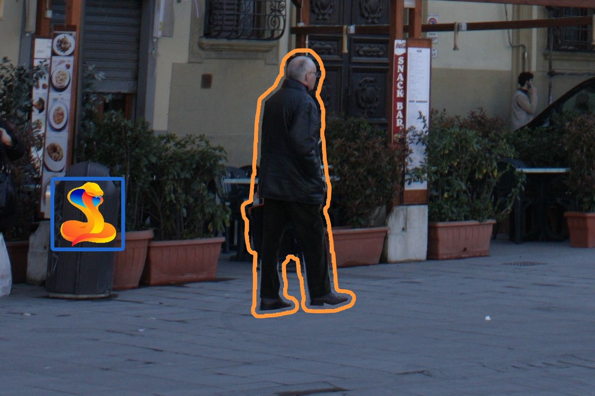
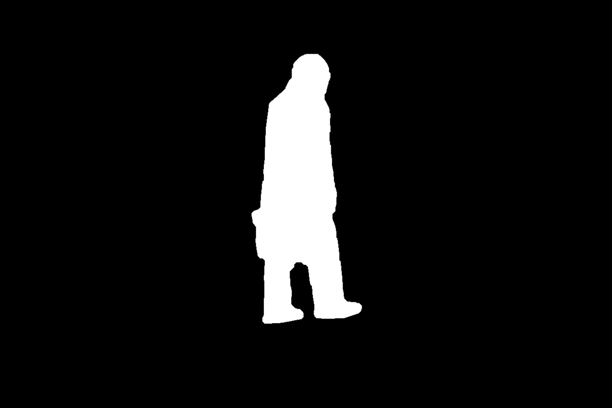
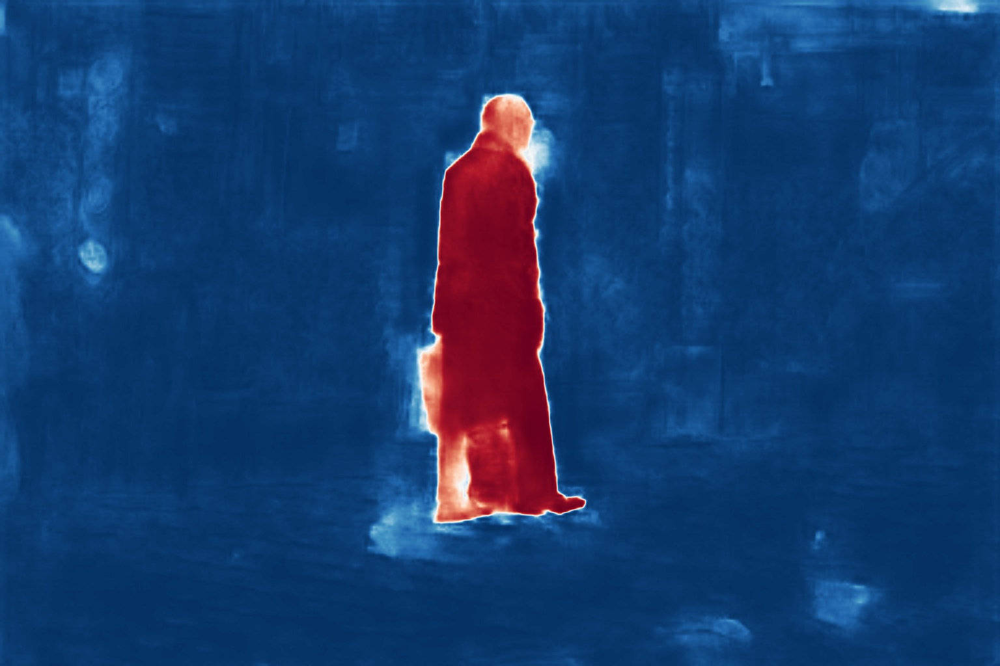
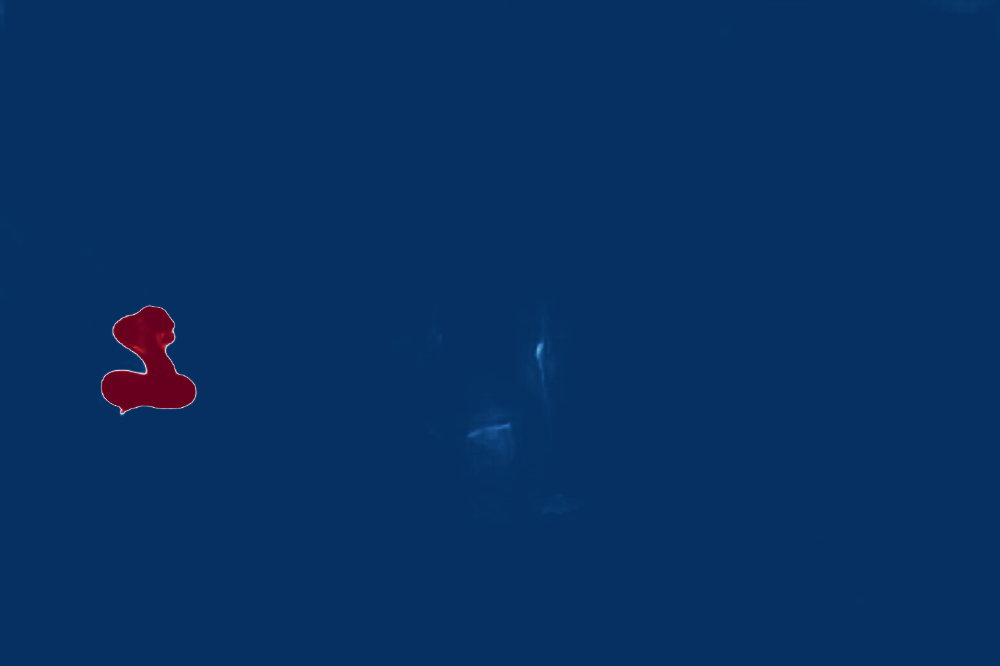
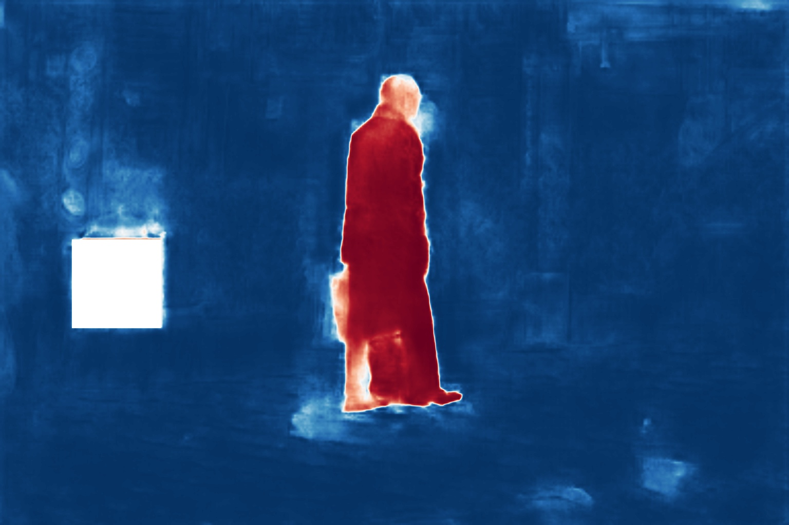
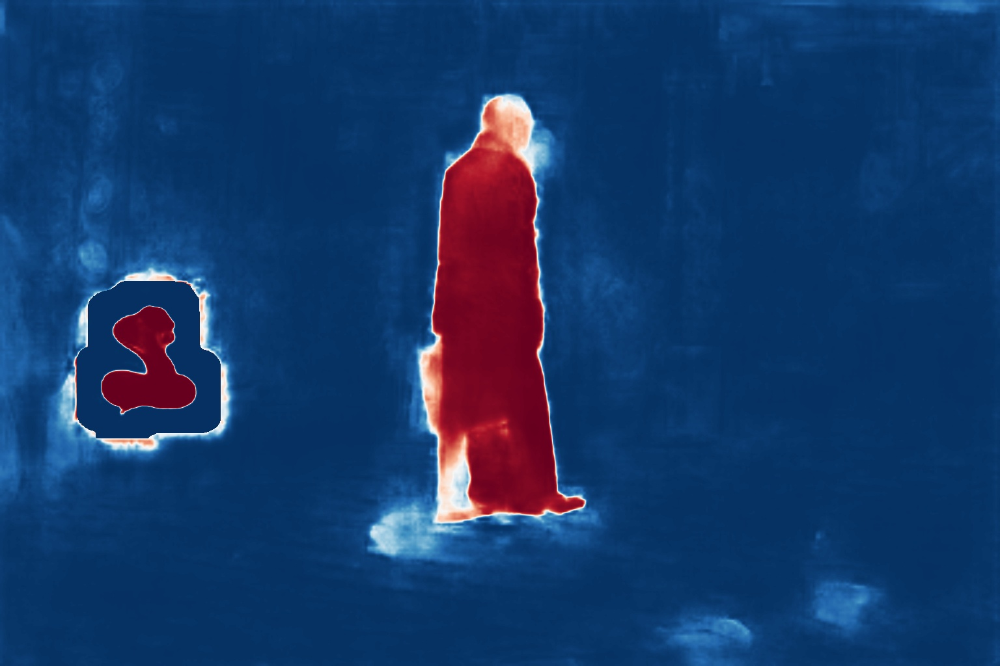

# Ignoring the Decoy: Masked Convolutions

[](https://xstaelen.github.io/Masked-convolutions/)
[](https://openaccess.thecvf.com/content/WACV2026W/SynRDinBAS/html/Staelens_Ignoring_the_Decoy_Exposing_and_Tackling_Forensic_Distractions_in_Image_WACVW_2026_paper.html)
[](https://media.idlab.ugent.be/)

Official PyTorch implementation of the paper **"Ignoring the Decoy: Exposing and Tackling Forensic Distractions in Image Forgery Localization using Masked Convolutions"** (Xander Staelens, Peter Lambert, Glenn Van Wallendael, Hannes Mareen — IDLab, Ghent University – imec).

<table align="center">
  <tr>
    <td align="center"><br/><sub>(a) Forged image with distraction</sub></td>
    <td align="center"><br/><sub>(b) Ground-truth mask</sub></td>
    <td align="center"><br/><sub>(c) TruFor — no distraction</sub></td>
  </tr>
  <tr>
    <td align="center"><br/><sub>(d) TruFor — distraction present (fails)</sub></td>
    <td align="center"><br/><sub>(e) Ours — manual mask (recovers)</sub></td>
    <td align="center"><br/><sub>(f) Ours — automatic mask (recovers)</sub></td>
  </tr>
</table>

## Overview

Image forgery localization (IFL) models can be thrown off by **forensic distractions**: benign visual elements such as logos, captions, and watermarks that occur naturally in real-world images. We show that state-of-the-art IFL models are highly sensitive to these distractions. **CAT-Net** and **TruFor** suffer average performance degradations of **15.06%** and **55.65%**, respectively, when a distraction is present.

To fix this, we introduce **masked convolutions**: drop-in replacements for standard convolution and pooling layers that simply ignore masked (distracted) regions of the input during inference. They require **no retraining** meaning existing pretrained weights can be reused directly. Distraction masks can be provided manually, or generated automatically through an iterative, two-step detection process built into the test scripts.

With masked convolutions, performance degradation drops to just **4.15%** for CAT-Net and **2.94%** for TruFor.

## Repository structure

```
maskedCNN.py    # Masked layer implementations (MaskedConv2d, MaskedAdaptiveAvgPool2d/MaxPool2d, MaskedSequential)
CAT-Net/        # CAT-Net adapted to use masked convolutions
TruFor/         # TruFor adapted to use masked convolutions
images/         # Example input images
covers/         # Example distraction masks (PNG, same size as input, white = masked)
evaluation/     # Paper evaluation splits, distraction PNGs, dataloader, and evaluation script
create_env.sh   # Conda environment setup script
```

## Implementation

The masked layers are implemented as subclasses of standard PyTorch layers in `maskedCNN.py`. Each masked layer additionally takes a binary mask as input (shape `Bx1xHxW`, `1` = masked/ignored, `0` = unmasked), and returns the updated mask alongside its output so it can be passed to the next layer.

To use them, replace the standard layers in a model with their masked counterparts and thread the mask through the forward pass. No retraining, and no changes to the pretrained weights, are required.

## Adapted models

- **[TruFor](https://grip-unina.github.io/TruFor)** with masked convolutions — see the `TruFor/` folder.
- **[CAT-Net](https://github.com/mjkwon2021/CAT-Net)** with masked convolutions — see the `CAT-Net/` folder.

Modified files:
- `CAT-Net/lib/models/network_CAT.py`
- `TruFor/TruFor_train_test/lib/models/cmx/builder_np_conf.py`
- `TruFor/TruFor_train_test/lib/models/cmx/encoders/dual_segformer.py`
- `TruFor/TruFor_train_test/lib/models/cmx/decoders/MLPDecoder.py`
- `TruFor/TruFor_train_test/lib/models/cmx/net_utils.py`

## Setup

```bash
bash create_env.sh
```

This creates a local conda environment (`env/forensic`) with PyTorch and all required dependencies. Pretrained weights for TruFor and CAT-Net must be downloaded separately — see the READMEs in `TruFor/` and `CAT-Net/` for links — and placed in `weights/`.

## Usage

Run inference from within `TruFor/` or `CAT-Net/`:

```bash
python ./test.py -w [path to weights]
```

Options:
- `-in`, `-out` — input images (file, folder, or glob) and output folder (default: `../images`, `../output`)
- `-cover` — manual distraction masks: a single PNG, or a folder with masks matching the input filenames (white = masked region)
- `-idc` — enable **iterative automatic** distraction masking instead of a manual mask
  - `-irn` — number of refinement rounds (default: 2)
  - `-itr` — prediction threshold used to build the mask each round (default: 0.5)
  - `-idl` — mask dilation, in % of image width (default: 5.0)


Example without masking:
```bash
python ./test.py -w ../weights/trufor.pth.tar -in ../images -cover None -out ../output
```

Example with manual masking:
```bash
python ./test.py -w ../weights/trufor.pth.tar -in ../images -cover ../covers -out ../output
```

Example with automatic iterative masking:
```bash
python ./test.py -w ../weights/trufor.pth.tar -idc -in ../images -out ../output
```

## Paper Evaluation

The `evaluation/` folder reproduces the evaluation protocol used in the paper:

```
evaluation/
  datasets/       # Base images and ground-truth masks (download separately)
  distractions/   # Ten transparent distraction PNGs used in the paper
  splits/         # CSV splits used in the paper
  dataset.py      # On-the-fly distraction compositing dataloader
  model_test.py   # TruFor and CAT-Net evaluation script
  output/         # Per-image evaluation results
```

The 12 semicolon-separated CSV splits cover **DSO-1**, **IMD2020**, **OpenForensics**, and **VIPP**, each with an `original` condition without distractions, a `small` condition with distractions sized 4-12% of the image's long side, and a `large` condition with distractions sized 12-24%. They specify the image and mask paths, distraction PNG, distraction size and position, post-processing JPEG quality, output width, and mask inversion where needed. Images are resized and center-cropped to a 1536-pixel long side and JPEG-compressed with a randomly assigned quality factor between 85 and 95.

Download the original datasets from their respective sources. Either place them in `evaluation/datasets/`, or pass the folder containing them with `-d`.

Run evaluation from within `evaluation/`:

```bash
python ./model_test.py -m [model] -csv [split CSV] -d [dataset folder] -w [path to weights]
```

Options:
- `-m` — model: `TruFor`, `TruFor_masked`, `CAT-Net`, or `CAT-Net_masked`
- `-mask` — masking mode (only used for masked models): `none`, `auto` (the composited distraction cover), or `iterative` (two inference rounds, threshold 0.5, 5% long-side dilation)
- `-csv` — evaluation split CSV
- `-d` — folders containing the dataset images/masks (default: `./datasets`)
- `-dis` — folder containing the distraction PNGs (default: `./distractions`)
- `-w` — model checkpoint
- `-out` — per-image IoU, MCC, and F1 results CSV (default: `./output/results.csv`)
- `-gpu` — GPU index; use `-1` for CPU


Example with iterative automatic masking:
```bash
python ./model_test.py -m TruFor_masked -mask iterative \
  -csv "splits/IMD2020_random_distractions_QF_(85-95)_small_(4.0-12.0).csv" \
  -d ./datasets -dis ./distractions -w ../weights/trufor.pth.tar \
  -out ./output/results_IMD2020_small_iterative.csv
```

_Note:_ Results may differ slightly from those reported in the paper due to differences in software versions, hardware, and numerical nondeterminism.

## Citation

If you use this work, please cite:

```bibtex
@InProceedings{Staelens_2026_WACV,
    author    = {Staelens, Xander and Lambert, Peter and Van Wallendael, Glenn and Mareen, Hannes},
    title     = {Ignoring the Decoy: Exposing and Tackling Forensic Distractions in Image Forgery Localization using Masked Convolutions},
    booktitle = {Proceedings of the IEEE/CVF Winter Conference on Applications of Computer Vision (WACV) Workshops},
    month     = {March},
    year      = {2026},
    pages     = {924-932}
}
```

## Acknowledgments

This work was funded in part by IDLab (Ghent University – imec), by Flanders Innovation & Entrepreneurship (VLAIO), by Research Foundation – Flanders (FWO) (1SA9O26N & G0A2523N), and by the European Union.

This work builds on and adapts [TruFor](https://grip-unina.github.io/TruFor) (GRIP-UNINA) and [CAT-Net](https://github.com/mjkwon2021/CAT-Net) (Myung-Joon Kwon). Please refer to their respective licenses in `TruFor/` and `CAT-Net/` for terms of use of the underlying models and code.
